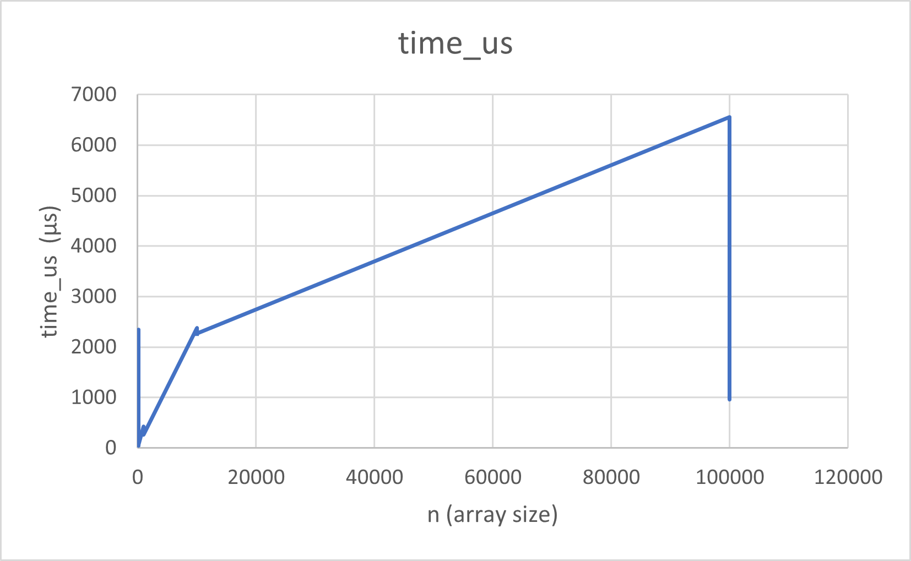
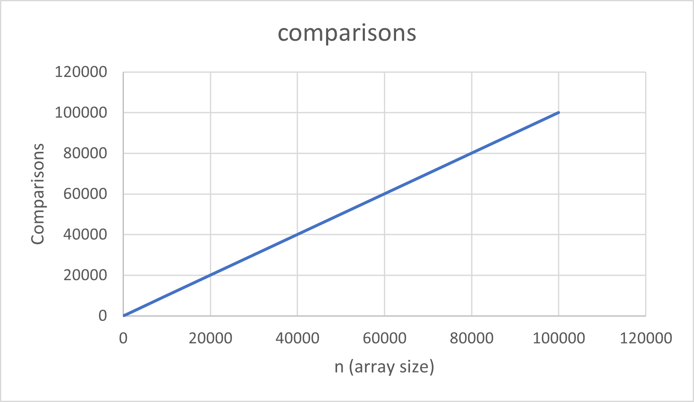

# Kadane’s Algorithm — Maximum Subarray (Java + Maven)

A complete Java project implementing **Kadane’s Algorithm** for the Maximum Subarray problem, extended with **optimization**, **metrics tracking**, **CLI interface**, and **testing** support.  
Built using **Maven** for clean modular structure and reproducible builds.

## Overview

**Kadane’s Algorithm** finds the contiguous subarray with the maximum possible sum in linear time **O(n)** and constant extra space **O(1)**.  
This repository combines several modules from different branches into one unified project:

- `algorithms/` → Core Kadane implementation
- `optimization/` → Enhanced version with boundary and memory optimizations
- `metrics/` → PerformanceTracker for counting comparisons, assignments, and operations
- `cli/` → Command-line runner for executing and benchmarking algorithms
- `testing/` → JUnit-based testing suite for validation and coverage

## Project Structure

- pom.xml
- README.md
- src/
    - main/
        - java/
            - algorithms/
                - Kadane.java
            - optimization/
                - OptimizedKadane.java
            - metrics/
                - PerformanceTracker.java
            - cli/
                - MainCLI.java
    - test/
        - java/
            - testing/
                - KadaneTest.java

## Build and Run

- To build:
  mvn -q clean package
  
to run the CLI:
java -cp target/assignment2_kadane-1.0.jar cli.MainCLI

Example:

Enter array elements: -2 1 -3 4 -1 2 1 -5 4
Maximum subarray sum = 6
Indices: [3, 6]

## Usage (as a Library)
import algorithms.Kadane;
import metrics.PerformanceTracker;

public class Demo {
public static void main(String[] args) {
int[] arr = {-2, 1, -3, 4, -1, 2, 1, -5, 4};

        // Basic usage
        Kadane.Subarray result = Kadane.maxSubarray(arr);
        System.out.println(result);

        // With metrics
        PerformanceTracker tracker = new PerformanceTracker();
        Kadane.Subarray tracked = Kadane.maxSubarray(arr, tracker);
        System.out.println(tracked);
        System.out.println("Operations: " + tracker.getOps());
    }
}

## Testing

- All tests are stored in:
  - src/test/java/testing/KadaneTest.java
- Run tests with:
  - mvn test

Expected result:

Tests run: 6, Failures: 0, Errors: 0, Skipped: 0

## Features Summary

- Kadane Algorithm — finds the maximum subarray sum in O(n)

- Optimization Module — improved version for negative-only arrays

- Metrics Tracker — counts comparisons, operations, and assignments

- CLI Interface — allows user input from terminal

- JUnit Tests — ensures correctness and reliability

## Algorithm Summary

- Core idea:
  - bestEndingHere = max(a[i], bestEndingHere + a[i])
  - bestSoFar = max(bestSoFar, bestEndingHere)

- Tracks start and end indices when best sum updates

- Returns (0, -1, -1) for empty arrays

- Works with both positive and negative numbers

- Time complexity: O(n)

- Space complexity: O(1)

## Performance Metrics

- Based on runs from the CLI or test suite:
  - Time grows linearly with input size
  - Comparisons and assignments also scale linearly 
- Stored plots (optional):
  - docs/performance-plots/time_vs_n.png 
  - docs/performance-plots/comparisons_vs_n.png

## Performance Results

After running `cli.BenchmarkRunner`, the algorithm produced the following performance data.

| Metric | Behavior |
|--------|-----------|
| Time (μs) | Grows roughly linearly with n |
| Comparisons | Also linear with n |

### Time vs n

### Comparisons vs n

## Troubleshooting

- NullPointerException → Check if array is not null

- Maven build errors → Verify Java 17+ and correct pom.xml

- Classpath issues → Use full path when running JAR (-cp target/...)

## Acknowledgments

Developed for the Design and Analysis of Algorithms course.
Implements clean code, modular design, and performance tracking principles.

## Related Branches

master — final integrated version

feature/algorithm — core implementation

feature/optimization — improved performance version

feature/metrics — operation counter

feature/cli — command-line interface

feature/testing — unit tests

Author: Makhanbetiyar Begina
Repository: assignment2_kadane

